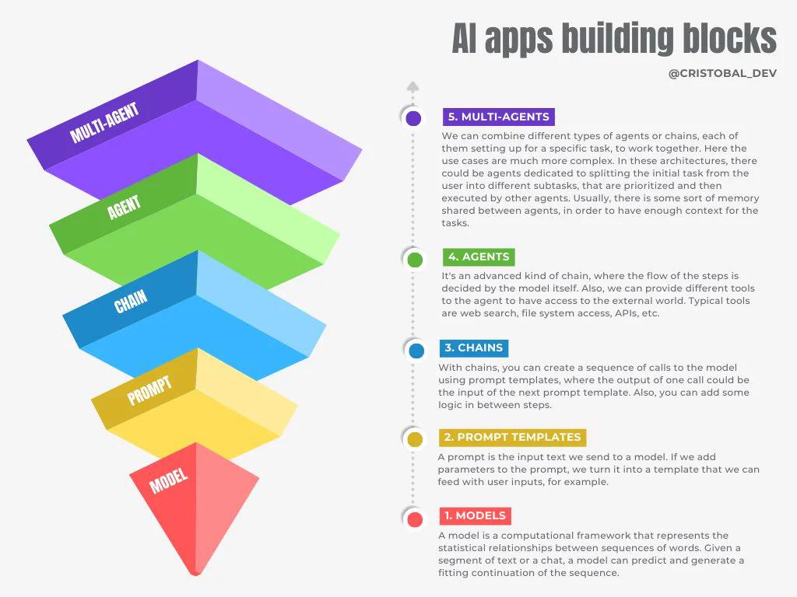

### Overview

#### LEAN

**精益 [LEAN](https://theleanway.net/The-Five-Principles-of-Lean)** a way of thinking about **creating** needed value **with fewer resources and less waste**.

1. Define Value 创造价值
2. Map Vaule Stream 映射价值流
3. Create Flow 创建流程
4. Establish Pull 建立拉取（系统）= Just-in-time delivery 准时交付
5. Pursue Perfection 追求完美，持续改进

#### Waterfall

**[Waterfall](https://www.techtarget.com/searchsoftwarequality/definition/waterfall-model) Model** a **linear, sequential** approach to the software development lifecycle.

1. Requirements 需求
2. Analysis 分析
3. Design 设计
4. Implementation 设计
5. Testing 测试
6. Maintenance 维护

:cry:

- **缺乏灵活性**：按照固定顺序的线性的开发模式，每个阶段都有明确的开始和结束时间。这种刚性的开发流程无法适应快速的需求变化和灵活性要求。 
- **长时间交付周期**：要求在进入下一个阶段之前完成上一个阶段的所有工作，导致项目的交付周期长。如果需求发生变化或者出现问题，则可能需要回到前面的阶段。
- **高风险**：测试和部署通常在开发的最后阶段进行，这意味着问题只能在开发结束后才会被发现。这导致修复问题的时间成本会很高，增加了项目失败的风险。
- **缺乏协作和沟通**：不同团队的成员在不同阶段工作，他们之间的沟通和协作比较少，导致信息传递不畅、问题未能及时发现和解决。
- **无法快速响应市场需求**：需要等整个项目的完成才能交付产品，无法及时响应市场需求的变化。在快节奏的市场环境中，容易出现无法满足用户需求的情况

#### Agile

[Agile Development](https://www.atlassian.com/agile) an **iterative** approach to that focuses on continuous releases and customer feedback.

Design → Build → Test → Review

“小步快跑”：把开发过程拆分成 N 个敏捷开发周期（2-8w），每个开发周期结束之后，随即交付。

[12 Pinciples](https://www.agilealliance.org/agile101/12-principles-behind-the-agile-manifesto/)

1. 最高目标是，通过**尽早和持续地**交付有价值的软件来满足客户。
2. 欣然面对需求变化—即使在项目开发后期。要善于利用**需求变更**，帮助客户获得竞争优势。
3. 要**不断的交付**可用的软件，周期从几周到几个月不等，而且越短越好。
4. 项目过程中，业务人员与开发人员必须在**一起工作**。
5. **激发个体的斗志**，给他们以所需要的环境和支持，并相信他们能够完成任务。
6. 不论团队内外，最有效的沟通方法就是**面对面**的交谈。
7. **可工作的软件**是衡量进度的首要指标。
8. 敏捷过程倡导**可持续开发**。发起人、开发人员和用户要能够长期维持稳定的开发步伐。
9. 对技术的**精益求精**以及对设计的不断完善将提升敏捷性。
10. 要做到**简洁**，即尽量最大可能减少不必要的工作，这是一门艺术。
11. 最好的架构、需求和设计出自于自**组织团队**。
12. 团队**定期地反思**如何能提高成效，并相应地协调和调整自身的行为。

#### Scrum

敏捷开发框架 👈 Scrum Master :man_teacher:

- **RoadMap 路线图**：一个战略计划，展示了产品或项目的目标、时间线以及主要交付成果。
- <u>**Kanban 看板**：一种可视化项目管理方法，将工作项（任务）展示在看板上，帮助团队了解任务状态和进展。看板通常分为几个列。</u>
- **TODO List 待办事项列表**：列出需要完成的任务或工作项。
- **User Story 用户故事**：简化的需求描述方式。它从最终用户的角度，描述了一个功能或需求。
- **Topic 主题**：多个用户故事组织在一起。
- **Story Points and Estimation 故事点和估时**：用于衡量用户故事的复杂度、工作量或风险，而不是具体的时间
- **Burn-down Chart 燃尽图**：显示项目剩余工作量随时间的减少情况
- **Gantt Chart 甘特图**：以条形图的形式显示项目的各项任务、任务持续时间以及任务之间的依赖关系。
- <u>**Iteration Planning Meeting 迭代会**：每个迭代的开始时，团队确定要完成的工作以及如何实现目标。</u>
- <u>**Stand-up Meeting 站会**：团队每天进行的一次简短会议，团队成员汇报进展、计划和遇到的问题。</u>

误区 :cry:

- 理解和文化误区：敏捷 ≠ 管理
- 缺少专业的 Scrum Master，一般由项目管理者兼任，导致敏捷工具变成管理手段
- 身兼数职导致都做不好
- 过于敏捷的进度管理：用 Deadline 倒推做项目计划
- 重视进度，忽视质量，留下大量技术债 Tech Debt

O&M Pressure :cry: **矛盾：变更 vs. 稳定**

- 不堪重负：面对开发团队越来越多的发布次数要求，自身不堪重负
- 周末加班、通宵发版：盲目增加工作时间来提高发布次数
- 稳定性开始下降：受到工作时长、环境、团队文化的影响，线上稳定性开始出现下降
- 开始建立部门墙：运维团队 Leader 开始建立部门墙，美其名曰保证发布质量而刻意降低发布速度

#### DevOps

**DevOps = Agile + LEAN + IT Mgmt (Automation)**

:smile: Is

- 一种工程实践的**方法论**和团队**文化**
- 核心思想是让开发和运维**参与**到软件开发的整个生命周期
- 通过**自动化流程**打通开发和运维间的信息流和部门墙

:cry: Is not

- A Flow
- A Tool
- A way of management

**Focus**

- Logging 日志
- Distrbuted Tracing 分布式追踪
- Alarm 告警
- Metrics 指标
- Configuration 配置
- Doc 文档

#### AIOps

AIOps 使用 AI **简化**运维工作流（分析 + 自动化）的技术方案，包括机器学习，数据分析等技术。

:smile:

- 持续观测监控数据流：AIOps 对数据处理的吞吐量和敏感度远远超过人工
- 解决运维团队孤岛问题：AIOps 能够通过业务指标、日志、追踪数据关联性随时发现问题
- 预测问题并提前解决：借助机器学习预测问题，而不是被动地解决问题
- 根因分析：借助机器学习技术快速处理大数据，并确定问题的根本原因

| Layer                   |                                                        |
| ----------------------- | ------------------------------------------------------ |
| Interface (Declarative) | Restart, Rollback, Tuning, Release                     |
| Modeling                | Data Analysis, Data Modeling, Deep Learning, Big Model |
| Stroage                 | Time-sequence, Repositry, Read-time, Relational        |
| Access                  | Logging, Tracing, Metics, Telemetry, Health Check      |
| Deployment              | VM, Container, Serverless, Functional, Edge Computing  |

Meta

| Type       | Meta                           |
| ---------- | ------------------------------ |
| Service    | Encoding, Version, SDK         |
| Deployment | Workload, Node, CPU, Mem, Disk |
| Business   | Team, Responsible              |

:cry: 传统分析：纵向时间轴，找到故障时刻所有的指标和日志的方式递归查下游分析根因。人工 + 复杂 + 经验驱动 + 低效。

:smile: **LLM Large Language Model 大语言模型**的出现极大降低了**数据建模**和**分析**的难度。多专家模式。

{Log, Metric, Traccing} → **LLM Agent** → {Log Agent, Metric Agent, Traccing Agent} → Platform ← API/CLI

**Building Block** :package:

- **Multi-Agent**：多个 Agent 分工和相互协作
- **Agent**：自主思考、决策、行动
- **Chains**：模型链式调用，上一个输出作为下一个输入
- **Prompt**：提示词工程，例如 zero-shot、few-shot
- **Model**：各种大模型 API

**Core** :sunrise:

- **Fine-tuning**： 微调
- **RAG**：Retrieval-augmented Generation 检索增强生成
- **Function Calling**：函数调用（链式、意图识别等）
- **JSON Mode**：大模型稳定输出 JSON
- **Prompt Engineering**：提示词质量决定输出质量

**Challenge** :fist_raised:

- 运维场景严肃性决定对错误容忍度低，大模型幻觉无法完全解决
- 数据隐私、安全性、合规等限制，大模型需支持低成本的私有部署
- 运维高质量的标注数据、语料和知识库不足
- 很难处理大量的实时数据（上下文 Token、成本限制）
- 如何结合存量的 DevOps 运维工具

**Observability** :telescope:

- 集成 LangSmith 实现 LLM Tracing（SaaS）
- 开源替代：Langfuse
- 查看 Input（Prompt）、Output、Tools 调用和调用结果
- 基于 Tracing 内容在线调试（Prompt + 上下文）

**Cloud Native**

- OpenTelemetry (All-in-one)
- eBPF/Cilium/Hubble (zero-intrusive)

**Algorithms**

- 统计分析算法：ANOVA、标准差、t 检验、皮尔逊相关系数、箱型图
- 时序分析和预测算法：SARIMA、LSTM、Prophet
- 机器学习分类和回归算法：决策树、SVM、K 近邻、梯度提升
- 异常检测和变更点检测算法：孤立森林、K 均值聚类、DBSCAN
- 日志聚类算法：K-means、DBSCAN

**Agent**

- 将个人运维知识库接入 LLM，构建个人运维数字分身，接受业务方简单的运维问答。
- 构建业务运维知识库：指标 → 解释 → 解决方案