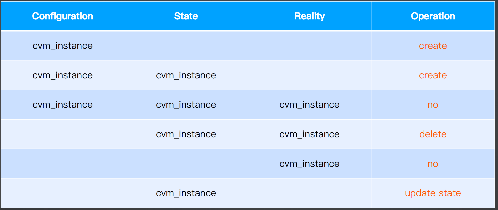
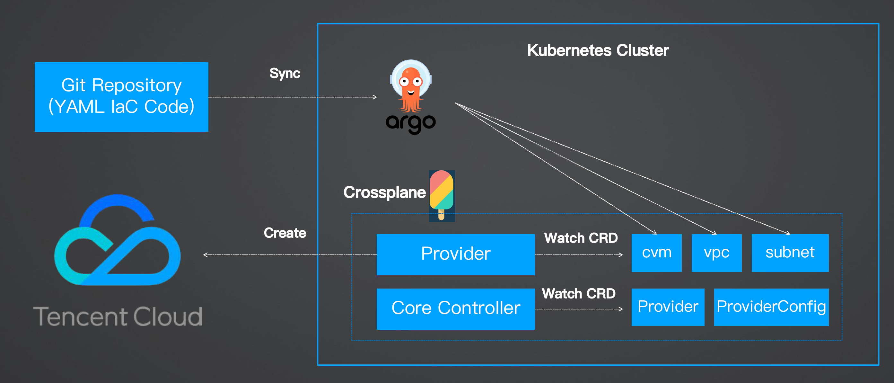

## IaC

**How to create a resource on cloud?** GUI, API, CLI... Imperative

**IaC** Infrastructure as Code 基础设施即代码 

- **Declarative** → Drive desired state
- Leverage Git **version control**
- **Stateful**
- **Idempotent**

:package:

- 以代码工作流来创建基础设施
- 安全更新现有的基础设施（dryrun）
- 集成 CI/CD，构建 DevOps 工作流
- 提供可复用的模块，方便协作和共享
- 实施安全策略和生产标准
- 实现基础设施的团队协作

Impl

- [Terraform](https://www.terraform.io/)
- [Pulumi](https://www.googleadservices.com/pagead/aclk?sa=L&ai=DChcSEwjUytSV3KuIAxWi1hYFHQsXCYsYABAAGgJ0bA&co=1&ase=2&gclid=CjwKCAjwreW2BhBhEiwAavLwfM77swkH874_n7WMoNhw6XoZly30KaYCyI8CEslOaSJgXN5N8wOq1xoCRtEQAvD_BwE&ohost=www.google.com&cid=CAESVOD2oa7fUt3--lNRVngwmdk-EbFUcms3yjMbBzfbZHTspdj36aW3DUFq4MXKhAnvTbZamiiKLgmvr7neztihSNaUw0OmurJjOWjZZL12boVJZb8aBw&sig=AOD64_2t4jfG0buguG_yEzTJjjsN2hR0IQ&q&nis=4&adurl&ved=2ahUKEwiUps-V3KuIAxVHbvUHHf5SKBAQ0Qx6BAgPEAE)
- [Crossplane](https://www.crossplane.io/)

## Terraform

An IaC tool llows you to **build, change, and manage your infra** in a safe, consistent, and repeatable way.

**Features**

- [HCL](https://developer.hashicorp.com/terraform/tutorials/configuration-language) (Domain-specific Language)
- Executable-doc
- Human/Machine-readable
- Easy to learn & use
- Test, Reusage, Automatation
- Cloud platform agnostic

### Arch

**Diff**(Manifest `.tf`, State `.tfstate`) → Cloud Platforms via [Providers](https://registry.terraform.io/browse/providers)/Provisioners.


Version control on Provider

- 不指定默认最新版；**建议固定版本**，防止上游更新导致 IaC 不可用
- 版本操作符 `=`、`!=`、`>`, `>=`, `<`, `<=`、`~>`（悲观约束：同时约束最旧和最新版本）

### Basics

```bash
# download providers & modules from reg & save to .terraform/providers
# .terraform.lock.hcl for dep
$ terraform init
$ terraform init --plugin-dir .terraform/providers

# dry-run/preview
# diff(.tf, .tfstate)
$ terraform plan

# apply infra, provider → API → cloud platform
$ terraform apply
$ terraform apply --auto-approve

# clean up infra, provider → API → cloud platform
$ terraform destroy
$ terraform destroy --auto-approve

# import resource that is not managed by terraform
$ terraform import <resource_defined_in_.tf> <resource_id>
```

`terraform.tfstate` 

- It describes acutal state of infra
- Do remember to de-sensitivize
- It is usually kept in **remote backend** - [Terraform cloud](https://app.terraform.io/app/organizations), see demo2.
- Removed after destroy



```bash
# acutal → state
$ terraform refresh：从基础设施实际状态更新 state 状态

# list state
$ terraform state list

# rm state
$ terraform state rm

# pull state from remote to local
$ terraform state pull

# push local state to remote
$ terraform state push
```

### Advanced

Layouts

```bash
$ tree
.
├── Readme.md
├── main.tf      # define infra, can split into multiple such as cos/cvm/k8s.tf
├── outputs.tf   # output after apply
├── variables.tf # var to be ref. in *.tf
└── version.tf   # provider & cli ver.
```

How to set variables? Precedence

1. 通过在命令行配置 `terraform apply -var="prefix=values"`
2. 指定配置文件 `terraform apply -var-file="testing.tfvars"`
3. **环境变量 `export TF_VAR_prefix=values`** 
4. 定义的默认值
5. 交互式输入

**Expr**

- 模板变量
- 值引用
- 运算符（!, *, /, +, -, >=, ==, !=, &&）*
- 条件表达式（<CONDITION> ? <TRUE VAL> : <FALSE VAL>）
- For 表达式（ [for s in var.list : upper(s)] ）
- Splat 表达式（var.list[*].id）
- 动态块
- 条件约束（变量类型、版本）

**Function**

- 数值函数（abs、floor、log、max、min、pow）
- 字符串函数（format、join、lower、regex、replace、split、substr）
- 集合函数（concat、containers、flatten、list、map、merge、reverse、sort）
- 编码函数（base64、json、urlencode、yaml）
- 文件系统函数（dirname、abspath、file、basename、**templatefile**）
- 时间日期函数（timestamp、formatdate、timeadd）
- 哈希和加密函数（sha1、md5、sha256、sha512、uuiid）
- 类型转换函数（tolist、tomap、toset、tostring、type）

**Meta Arg** 控制资源创建/销毁的行为 → `resource {}` & `module {}`

- `depends_on` 显式指定依赖关系，`terraform graph` 可根据引用自动生成资源的依赖关系图 DAG 有向无环图
- `count` 指定创建资源的个数，类数组，可通过下标访问。
- `for_each` 在单个块中创建多个资源
- `lifecycle`
  - **create_before_destroy 在销毁资源前先进行创建，实现 0 停机**
  - prevent_destroy 阻止删除
  - ignore_changes 忽略差异
  - replace_triggered_by 当引用项目发生变化时候替换资源

**resource.provisioner** 在本地或者远端虚拟机中执行动作

- `file` 将本地文件或目录复制到远端虚拟机
- `local-exec` 在本地执行一段命令，注意平台差异
- `remote-exec` 在远端虚拟机中执行命令，可以是 inline shell 命令，也可以指定 bash 脚本文件（先通过 `file` 将脚本上传）
- `vendor`

```json
resource "null_resource" "example" {
  provisioner "file" {
    source      = "local/path/to/file.txt"
    destination = "/remote/path/to/file.txt"
  }
}

resource "null_resource" "example" {
  provisioner "local-exec" {
    command = "echo 'Hello, Terraform!'"
  }
}

resource "null_resource" "example" {
  provisioner "remote-exec" {
    inline = [
      "echo 'Hello, Terraform!'",
      "hostname",
    ]
  }
}

resource "null_resource" "example" {
  provisioner "vendor" {
    command = "go mod vendor"
  }
}
```

:confused: **如何创建多环境基础设施？**本质是区分 .tfstate 文件

1. 使用目录分区 `./{dev,test}/*.tf` 

   :smile: 环境目录清晰，不容易出错

   :cry: 维护性/复用性差...

2. Terraform Workspace `terraform.tfstate.d/{dev,test}`

   :smile: 一套代码 N 个环境，实现了代码复用

   :cry: 增加了执行上下文的概念，容易出错

```bash
$ terraform workspace list

# apply under dev
$ terraform workspace new dev
$ terraform apply -auto-approve

# apply under test
$ terraform workspace new test
$ terraform apply -auto-approve

$ terraform workspace select dev
```

3. **Module + Directory**

- Module 是重用 Terraform 代码的主要方式，更好地组织和管理 IaC 源码，包括配置、微服务、人员角色。
  - Root 包含所有工作目录下 .tf 文件，默认模块
  - Sub 通过 .tf 文件引用的外部模块
    - Local
    - Terraform Registry
    - HTTP
    - Git
    - S3
- Module 抽象原则
  - 以产品 or 功能拆分为模块
  - 为模块设置必要的**入参和逻辑条件判断**
  - 为模块的输入提供有用的**默认值**
  - 设置**输出**，作为下游的**输入**，便于和其他模块进一步集成

```bash
├── modules
│ ├── cvm
│ │ ├── main.tf
│ │ ├── outputs.tf
│ │ ├── variables.tf
│ │ └── version.tf
│ └── k3s
│ ├── main.tf
│ ├── outputs.tf
│ └── variables.tf
└── testing            # test env
│ ├── main.tf
│ └── variables.tf
├── dev                # dev env
│ ├── main.tf
│ └── variables.tf
```

## [Crossplane](https://www.crossplane.io/)

> YAML → Infra

A framework for building cloud native control planes without needing to write code. 

- **K8s Operator，YAML-based CRD 方式定义 infra**
  - **监听 CRD 并调用云平台的 provider 创建 infra**
- 无需代码，声明式 API
- 基础设施控制平面
- 多云和混合云支持
- 在 K8s 里运行 “Terraform”

[Marketplace](https://marketplace.upbound.io/)

**Fast-Pass**



```bash
# install Argo CD
$ helm repo add argo https://argoproj.github.io/argo-helm
$ helm install argocd argo/argo-cd -n argocd --create-namespace

# get argo secret
$ kubectl -n argocd get secret argocd-initial-admin-secret -o jsonpath="{.data.password}" | base64 -d
$ kubectl port-forward svc/argocd-server -n argocd 8080:80
$ kubectl apply -f setup

# UI: connect repo and application
# delete argocd application
```

