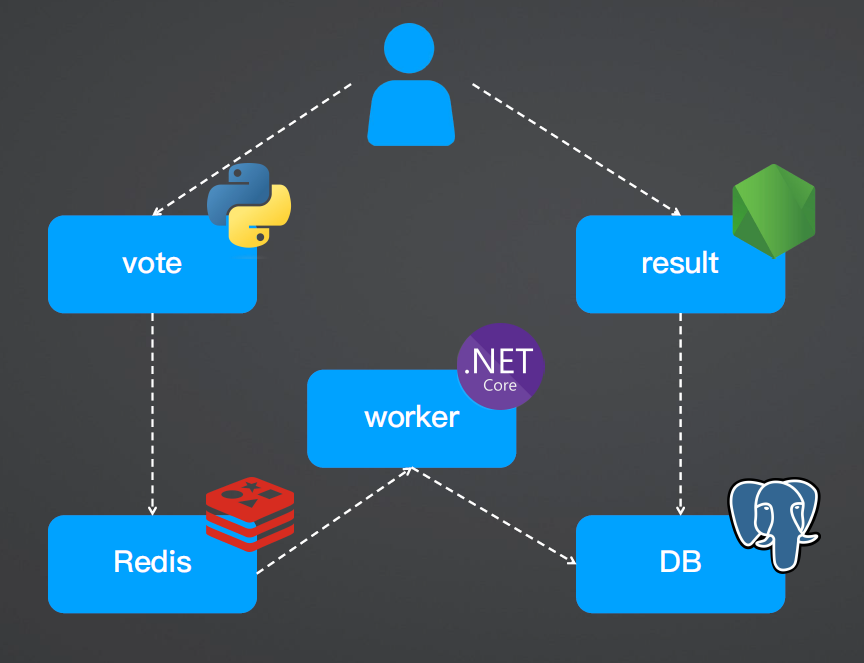
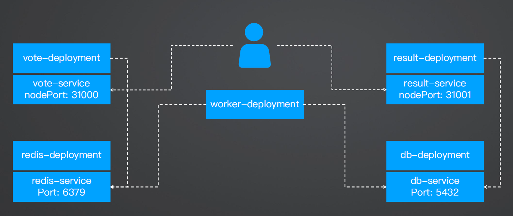

### voting-app

- vote: frontend 
- Redis: middle-ware
- worker: consumer
- DB: backend
- result: fronted to display

```bash
$ kubectl apply -f demo_04/demo_app/k8s-specifications
```





result Dockerfile

```dockerfile
FROM node:18-slim

# add curl for healthcheck
RUN apt-get update \
    && apt-get install -y --no-install-recommends \
    curl \
    tini \
    && rm -rf /var/lib/apt/lists/*

WORKDIR /app

# have nodemon available for local dev use (file watching)
RUN npm install -g nodemon

COPY package*.json ./

RUN npm ci \
 && npm cache clean --force \
 && mv /app/node_modules /node_modules

COPY . .

ENV PORT 80
EXPOSE 80

# nodejs starts in PID=1, no exit signal handling → zombie
# https://github.com/krallin/tini
ENTRYPOINT ["/usr/bin/tini", "--"]
CMD ["node", "server.js"]
```

### [wait-for](https://github.com/groundnuty/k8s-wait-for)

```bash
$ kubectl delete -f demo_04/demo_app_wait_for_db/k8s-specifications/db-deployment.yaml
```

```bash
# RBAC
$ kubectl create role pod-reader \
	--verb=get,list,watch \
	--resource=pods,services,deployments

$ kubectl create rolebinding default-pod-reader \
	--role=pod-reader \
	--serviceaccount=default:default \
	--namespace=defult
```

`result-deployment.yaml`

```yaml
spec:
  # ...
  template:
    # ...
    spec:
      initContainers:
        - name: wait-for-db
          image: ghcr.io/groundnuty/k8s-wait-for:v2.0
          # result shall wait for DB
          args: ["pod", "-lapp=db"]
```

```bash
$ kubectl apply -f demo_04/demo_app_wait_for_db/k8s-specifications/db-deployment.yaml
```

clean up

```bash
$ kubectl apply -f demo_04/demo_app_wait_for_db/k8s-specifications/
```

### wait-for-flow

redis -> postgres -> worker -> vote -> result

`db-deployment.yaml`

```yaml
spec:
  # ...
  template:
    # ...
    spec:
      initContainers:
        - name: wait-for-db
          image: ghcr.io/groundnuty/k8s-wait-for:v2.0
          # result shall wait for DB
          args: ["pod", "-lapp=redis"]
```

`worker-deployment.yaml`

```yaml
spec:
  # ...
  template:
    # ...
    spec:
      initContainers:
        - name: wait-for-db
          image: ghcr.io/groundnuty/k8s-wait-for:v2.0
          # result shall wait for DB
          args: ["pod", "-lapp=db"]
```

`vote-deployment.yaml`

```yaml
spec:
  # ...
  template:
    # ...
    spec:
      initContainers:
        - name: wait-for-db
          image: ghcr.io/groundnuty/k8s-wait-for:v2.0
          # result shall wait for DB
          args: ["pod", "-lapp=worker"]
```

`result-deployment.yaml`

```yaml
spec:
  # ...
  template:
    # ...
    spec:
      initContainers:
        - name: wait-for-db
          image: ghcr.io/groundnuty/k8s-wait-for:v2.0
          # result shall wait for DB
          args: ["pod", "-lapp=vote"]
```

```bash
$ kubectl apply -f demo_04/demo_app_wait_for_flow/k8s-specifications/
```


