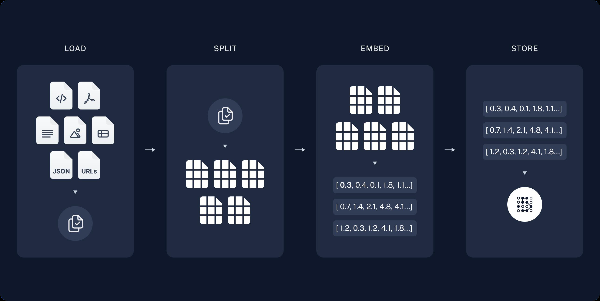
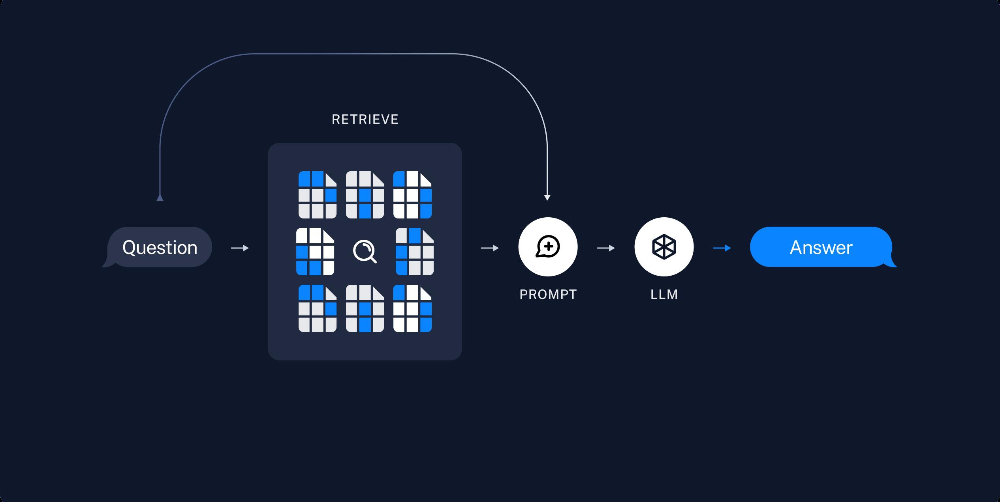

### RAG

Generated Knowledge Prompting 生成式知识提示：在上下文中提供额外的知识到 System Prompt 改善推理结果。

注：受限于 Token 长度限制，不能无限地往 system prompt 里写入生成式知识；但可以根据哟哦弄个胡问题动态组装通用知识。

**RAG 检索增强生成** Retrieval-augmented generation 将私有知识库引入 LLM 的过程

#### Index

> 建立索引：对私有知识库，包括加载知识库、拆分、向量化和存储过程 = “哪段知识可以解答用户提问”

1. 加载：加载不同格式的文档，借助文档加载器实现 :smile: 借助 langchain.text_splitter 文档加载器。
2. 拆分：按一定策略把文档拆分成小块，借助文档拆分器实现。
3. 嵌入：对文档块进行向量化 :smile: 专用模型 `text-embedding-3-small`，`text-embedding-3-large`。
4. 存储：将向量化的文档存放进数据库中。

#### Retrieve & Generate

> 检索和生成：从私有知识库中查询有关信息，并传递给模型进行对话 = “可以解答用户提问的知识内容”

1. 检索：根据用户的输入，借助检索器从向量数据库中检索出相关的块 :smile: langchain 检索器。
2. 生成：LLM 使用包含问题答案的块进行问答。

#### Principal

原理：输入（对问题本身也要进行向量化） & 数据库内（的分片）进行匹配；值越小越近似，取最小值的分片。

**注：输入向量维度和分片维度要一致，否则无法计算...**

余弦相似度：$Cosine Similarity = \frac{A \cdot B}{\|A\| \|B\|}$

欧氏距离：$Euclidean Distance = \sqrt{\sum_{i=1}^{n} (x_i - y_i)^2}$

#### RAG Prompt

"Please **use retrieved contexts to answer** the question. If nothing matched, please answer don't know."

#### Cons

:cry: 由于文本分片会把上下文逻辑截断，可能导致无法回答内在逻辑关联的问题。

:cry: 缺乏语义理解能力：只能回答显式检索问题，无法回答全局性/总结性问题。

### [Graph RAG](https://microsoft.github.io/graphrag/)

:smile: 借助 LLM 提取并建立知识库内部实体之间的关系，基于实体拓扑进行问答，提供**全局性问题**的答案。

可使用 Neo4j 查看实体关系。

### [Ragflow](https://github.com/infiniflow/ragflow)

An open-source RAG engine.