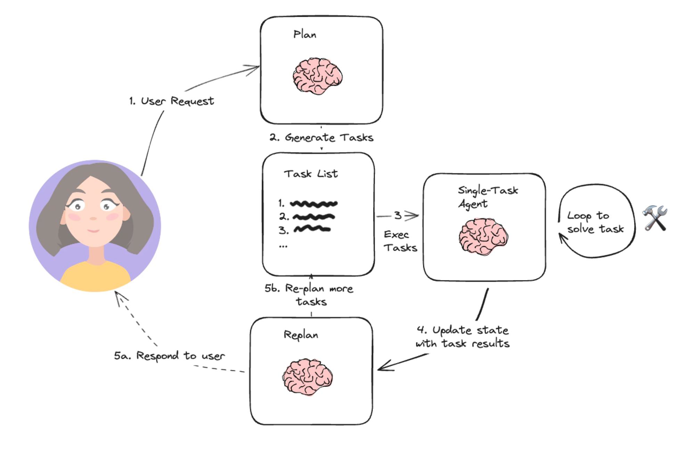
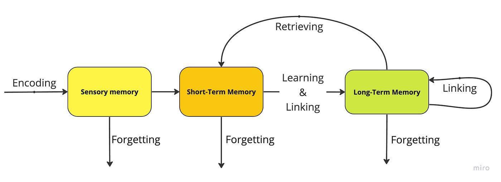
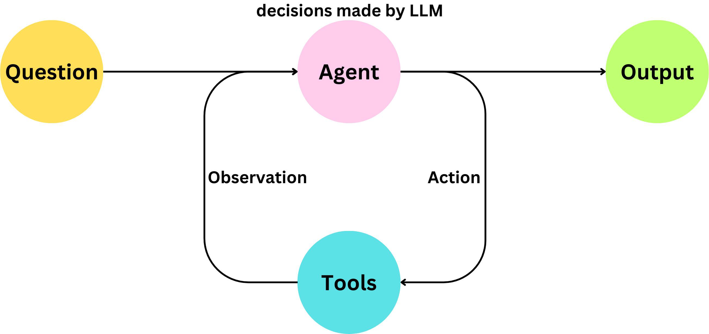
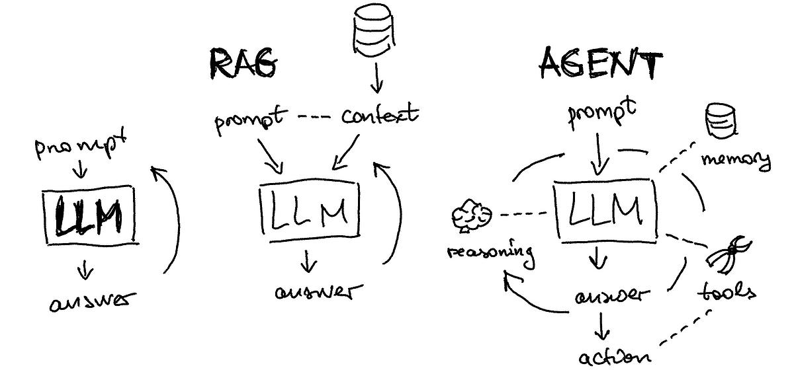
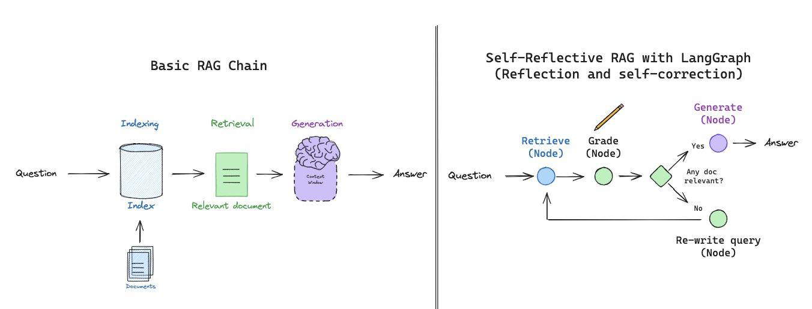

## Agents

### Overview

LLM-powered Autonomous Agent System 具有复杂推理能力、记忆和执行任务手段的**自主**代理。

**Planning 规划**

1. 用户发送请求
2. 规划拆解成多个子任务
3. 执行单个子任务，通过循环/迭代解决
4. 基于子任务的处理结果更新状态
5. 返回结果给用户，同时重新规划更多的任务 = 反思 Reflect
   - ReAct
   - Reflecion
   - Chain of Thought
   - Graph of Thought

**Memory 记忆**

- 短期：from context, window limited
- 长期：from vector store & history

**Tools 工具（外部调用）**

- 搜索（公有库）
- RAG（私有库）
- 代码解释器
- 数学计算
- API 调用

:confused: **Why?**

:cry: LLM 本身只输出文本，而无法采取任何行动...就像人的大脑一样，如果你没有手脚和记忆，大脑无法独立行动...

**RAG**

- Legacy 从向量数据库检索文档相关内容后直接回答问题。

  :cry: 检索文档内容不一定和问题存在相关性，可能检索出无用文档...

  :cry: LLM 存在一定概率幻觉...

- Agent 从 vector store

  :smile: 检索后，进一步检查文档内容跟问题是否匹配，如果匹配则回答问题，如果不匹配，则改写问题重新检索，循环往复...

### Design Pattern

**Reflection 反射模式**：让 AI 模型**自我反思**和**自我迭代**，不断优化输出，提高任务准确率。

:smile: 提高准确性和质量

:cry: 多次迭代和反馈耗时更长，成本更高；反射机制设计复杂...

**Tools**：让 AI 模型通过**调用外部工具**增强任务执行能力。

:smile: 利用代码解释器提高数学计算的准确性；扩充了模型行动范围

:cry: 增加外部依赖，协同增加复杂度...

**Planning**：让 AI 模型将复杂任务拆解为多个更小的步骤。

:smile: Divide & Conquer

:cry: 前后依赖...

**Multi-agent Collaboration**：让多个 Agent 分工协作提高任务执行效率和准确性。

:smile: 并行效率:up:

:cry: 复杂度...

### Agent RAG

流程：

1. 检索向量后，判断文本块是否包含问题答案
2. 若包含则进行回答
3. 若不包含则重新检索，匹配 +1 block，直到 max 循环次数

:hammer: Improvement

- 判断文本块大小，使用切片策略，避免上下文超限
- 改进向量搜索策略，例如通过增加 offset 参数过滤已验证无法回答问题的文本块
- 判断能否回答问题环节使用 JSON Mode 获得更稳定的结构化输出
