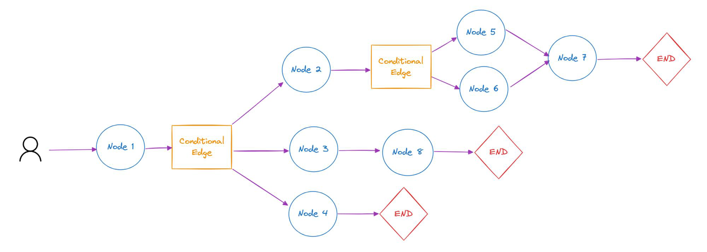

## [LangGraph](https://github.com/langchain-ai/langgraph)

> LangChain 面向定义 Directed Acyclic Graph 有向无环图，一旦前节点失败则后面的都会失败...（链式）
>
> LangGraph 面向定义 Directed Cyclic Graph  有向有环图，引入循环可以实现更复杂的 Agent

LangGraph 是一个构建在 LangChain 之上的库，旨在为 Agent 添加循环运算的能力。

A lib for building stateful, multi-actor app with LLMs, used to **create agent and multi-agent workflows**.

**"Agents as Graphs"**

- **Cycles and Branching** 实现循环/条件
- **Persistence** 持久状态 after each step，支持在任意节点 pause.resume
- **Human-in-the-Loop** 人为干预 approve/edit 下一个动作
- **Streaming Support** 支持异步流式输出
- **Integration with LangChain** 集成

### Architecture

**ReAct** = Reason + Act in an iterative process

1. 模型基于输入和之前的观察“思考”下一步采取什么动作
2. 模型从可用 tools 中选择一个 action
3. 模型生成选取 tool 的参数
4. Agent 运行时解析选中的 tool 并使用生成的参数进行调用
5. Executor 返回 tool 调用结果给模型视为一次观察
6. 重复过程知道 Agent 决定返回

**Super-step** = parallel 并行

### [Conceptual](https://langchain-ai.github.io/langgraph/concepts/high_level/)

- Stateful: Graph 定义 DCG 及其保存的状态，需往里面添加 Node，即 Node 容器。
- Node: 每个节点代表一个函数或一个计算步骤执行特定任务；节点相互依赖，可以是串行、并行和在某些节点循环运行。
- Edges: 连接图中的节点，**流程控制** entry/finish point。



### [How-to](https://langchain-ai.github.io/langgraph/how-tos/)

## LangSmith

开发的调试、日志和追踪平台，和 LangChain、LangGraph 原生集成。

[API KEY](https://smith.langchain.com/)

```python
os.environ["LANGCHAIN_TRACING_V2"] = "true"
os.environ["LANGCHAIN_ENDPOINT"] = "https://api.smith.langchain.com"
os.environ["LANGCHAIN_API_KEY"] = "..."
os.environ["LANGCHAIN_PROJECT"] = "default"
```

