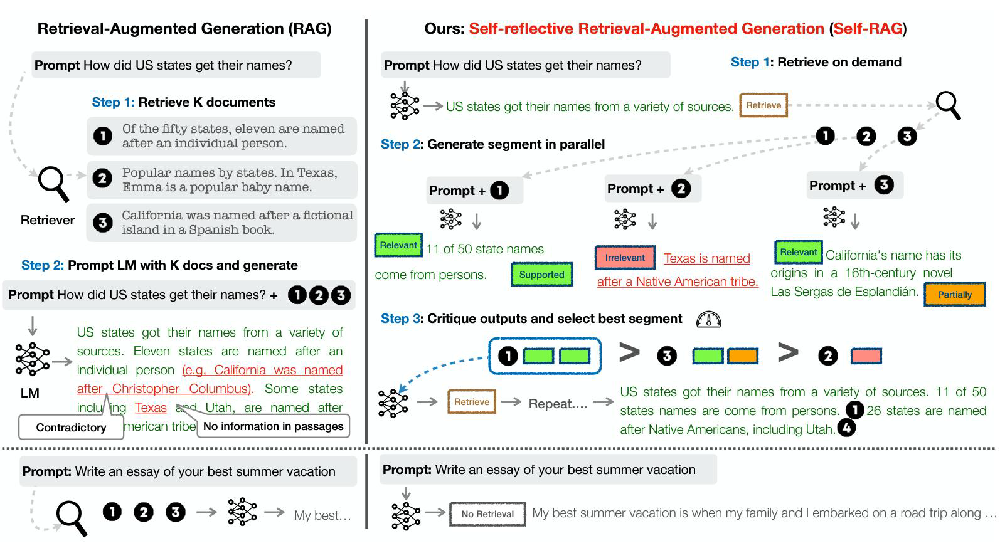
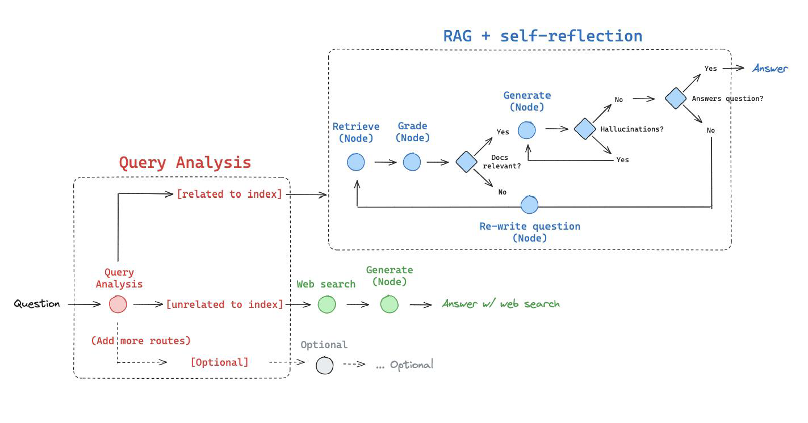

## Self-Reflective RAG

:page_facing_up: [Paper](https://arxiv.org/abs/2403.14403)

**Features**

- 对检索到的文档和生成的回答进行反思和评分，直到获得满意的回答
- 解决传统 RAG 粗暴检索固定数量段落以及回复准确性差的问题
- 显著提升长文本检索的准确性

**Cores**

- 路由器 Query Analysis：判断问题交由 Web 搜索还是 RAG 处理
- Web 搜索工具：针对近期事件的搜索
- 自适应 RAG 工具：针对知识库相关问题
  - **Retrive 检索 doc 节点**
  - **Grade 评级节点**
    - 判断获取 doc 内容是否相关（若不相关，**重写问题（节点）**）
  - **Generate 生成节点**
    - 判断是否有幻觉（若存在幻觉，重新生成）
    - 判断是否能回答问题（不能则**重写问题（节点）**）

### Tavily

Tavily 执行网络搜索，让 LLM 感知现实世界

Features

- 快速响应：相比较搜索引擎能更快返回结果
- 良好摘要：无需加载页面的所有内容
- 结果优化：针对 LLM 优化的搜索结果，提高准确率
- [API_KEY](https://app.tavily.com/home)