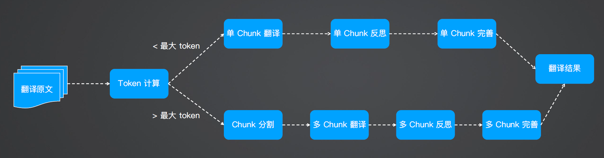

## [Translation Agent](https://github.com/andrewyng/translation-agent)

A reflection agentic workflow for machine **translation**.

1. 初始翻译：Prompt an LLM 进行翻译 from src to target language
2. 翻译改进：LLM 对翻译后的结果进行反思，并踢出建设性的建议用于提升翻译质量
3. 优化输出：使用建议优化翻译



```bash
$ pip install poetry
$ git clone https://github.com/andrewyng/translation-agent.git
$ cd translation-agent
$ poetry install
$ poetry shell # activates virtual environment

# translate
$ python examples/example_script.py
```

:smile: 基于反思工作流，翻译效果优于普通翻译工具；可定制化。

:cry: 翻译效果依赖于 LLM 的智力；相比较商业翻译引擎在特定专业领域略显不足；使用有一定的门槛；固定链式流程，无 Agent 自我思考迭代机制。

### Source

`one_chunk_initial_translation` 初始翻译

```python
"""
Args:
        source_lang (str): The source language of the text.
        target_lang (str): The target language for translation.
        source_text (str): The text to be translated.

    Returns:
        str: The translated text.
"""
```

`one_chunk_reflect_on_translation` 结果反思

```python
"""
Args:
        source_lang (str): The source language of the text.
        target_lang (str): The target language of the translation.
        source_text (str): The original text in the source language.
        translation_1 (str): The initial translation of the source text.
        country (str): Country specified for the target language.

Returns:
        str: The LLM's reflection on the translation, providing constructive criticism and suggestions for improvement.
"""
```

`one_chunk_improve_translat·ion` 结果优化

```python
"""
Args:
        source_lang (str): The source language of the text.
        target_lang (str): The target language for the translation.
        source_text (str): The original text in the source language.
        translation_1 (str): The initial translation of the source text.
        reflection (str): Expert suggestions and constructive criticism for improving the translation.

Returns:
        str: The improved translation based on the expert suggestions.
"""
```

