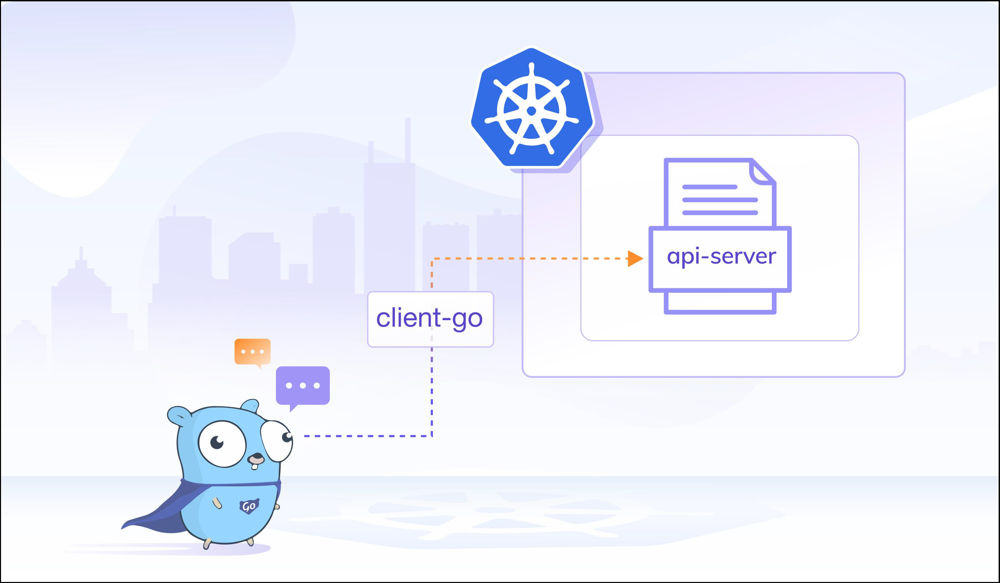

## Client-go

Client-go is Golang SDK to interact with K8s Cluster。



### API Group

CRUD on Core `/api` & Named `/apis`.

```bash
$ kubectl get <resources> -v6
```


### GVR & GVV

**GVR**: Group/Version/Resource (repr)

```json
{
  Group: "apps",
  Version: "v1",
  Resource: "deployments"
}
```

```bash
# Group: apps
# Version: v1
# Resource: deployments
https//127.0.0.1:6443/apis/apps/v1/namespace/default/deployments?limit=10
```

**GVK**: Group/Version/Kind (Go struct)

```json
{
  Group: "apps",
  Version: "v1",
  Kind: "Deployment"
}
```

### In-cluster

Note: AuthZ is required on Service Account otherwise 403.

```go
config, _ := rest.InClusterConfig()
```

Token & K8s cluster ca cert in pod: `/var/run/secrets/kubernetes.io/serviceaccount/[token|ca.crt]`

In-pod ENV: `KUBERNETES_SERVICE_HOST` & `KUBERNETES_SERVICE_PORT`

```go
func InClusterConfig() (*Config, error) {
	const (
		tokenFile  = "/var/run/secrets/kubernetes.io/serviceaccount/token"
		rootCAFile = "/var/run/secrets/kubernetes.io/serviceaccount/ca.crt"
	)
	host, port := os.Getenv("KUBERNETES_SERVICE_HOST"), os.Getenv("KUBERNETES_SERVICE_PORT")
    //...
}
```

### Client

ClientSet/DynamicClient/DiscoveryClient → [RestClient](https://github.com/kubernetes/client-go/blob/master/rest/client.go) → (APIMachinery) → APIServer

```go
// Interface captures the set of operations for generically interacting with Kubernetes REST apis.
type Interface interface {
	GetRateLimiter() flowcontrol.RateLimiter
	Verb(verb string) *Request
	Post() *Request
	Put() *Request
	Patch(pt types.PatchType) *Request
	Get() *Request
	Delete() *Request
	APIVersion() schema.GroupVersion
}
```

[ClientSet](https://github.com/kubernetes/client-go/blob/master/kubernetes/clientset.go)/DynamicClient/DiscoveryClient → RestClient → (APIMachinery) → APIServer

```go
type Interface interface {
	Discovery() discovery.DiscoveryInterface
	AdmissionregistrationV1() admissionregistrationv1.AdmissionregistrationV1Interface
	AdmissionregistrationV1alpha1() admissionregistrationv1alpha1.AdmissionregistrationV1alpha1Interface
	AdmissionregistrationV1beta1() admissionregistrationv1beta1.AdmissionregistrationV1beta1Interface
	InternalV1alpha1() internalv1alpha1.InternalV1alpha1Interface
	AppsV1() appsv1.AppsV1Interface
    // ...
}
```

ClientSet/DynamicClient/[DiscoveryClient](https://github.com/kubernetes/client-go/tree/master/dynamic) (any including CRD) → RestClient → (APIMachinery) → APIServer

:smile: YAML → Unstructured.

```go
type Unstructured struct {
	// Object is a JSON compatible map with string, float, int, bool, []interface{}, or
	// map[string]interface{}
	// children.
	Object map[string]interface{}
}
```

ClientSet/DynamicClient/[DiscoveryClient](https://github.com/kubernetes/client-go/blob/master/discovery/discovery_client.go) → RestClient → (APIMachinery) → APIServer

```bash
# cache under ~/.kube/cache/discovery
$ kubectl api-version
$ kubectl api-resource
```

### Watch

Event on resources → tigger.

:cry: NOT in Prod:

- Complexity ↑ when dealing with timeout & retry
- API Server pressure ↑
- Conn cannot be shared among multi-watch
- Event lost when conn is dropped
- Overload biz if piles of events
- No second chance if biz failed to handle event

### Informer

:smile: Prod:

- Watch-based but simpler, safer, high-perf
- Auto timeout & retry
- Local cache, API Server pressure ↓
- Full/Incremental Sync to ensure no events get lost
- `SharedInformerFactory` → `Informer`

++ **RateLimitingQueue** for retry incase EventHandler faild to process or Hot Loop

### Deepin

**Refletor**: List/Watch obj & push into Delta FIFO

**Delta FIFO**: queue(key) + map(key:delta)

**Controller**: pop key:delta from Delta FIFO

**Indexer**: for obj fetch by `GetByKey(key)` where key: `<ns>/<name>`

- `Indexers` 存储索引器，key 为索引器名称，value 为索引器实现的函数
- `IndexFunc` 计算 obj 用于索引的 key，client-go 默认是 MetaNamespaceIndexFunc
- `Indices` 存储 Index 类型名和对应类型的 Index 的映射
- `Index` 存储缓存数据，其结构为 K/V

**WorkQueue**:

- `Interface` 通用先进先出队列，支持去重机制
- `DelayingInterface` 延迟队列接口，延迟一段时间后再将元素存入队列
- `RateLimitingInterface` 限速队列接口，常用：失败重试 + 指数退避 + 限速


### CRD

Via DynamicClient from GVK → GVR by **RESTMapping**.

`NewDiscoveryRESTMapper`: plural & singular in CRD to build Resource → Kind

```go
clientset, _ := kubernetes.NewForConfig(config)
discoveryClient := clientset.Discovery()
apiGroupResources, _ := restmapper.GetAPIGroupResources(discoveryClient)
mapper := restmapper.NewDiscoveryRESTMapper(apiGroupResources)
mapping, err := mapper.RESTMapping(gvk.GroupKind(), gvk.Version)
resourceInterface := dynamicClient.Resource(mapping.Resource).Namespace("default")
```


