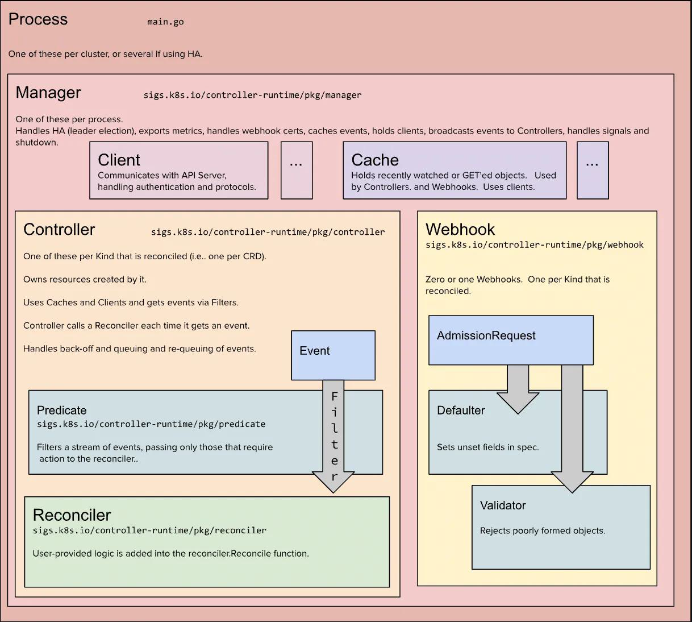
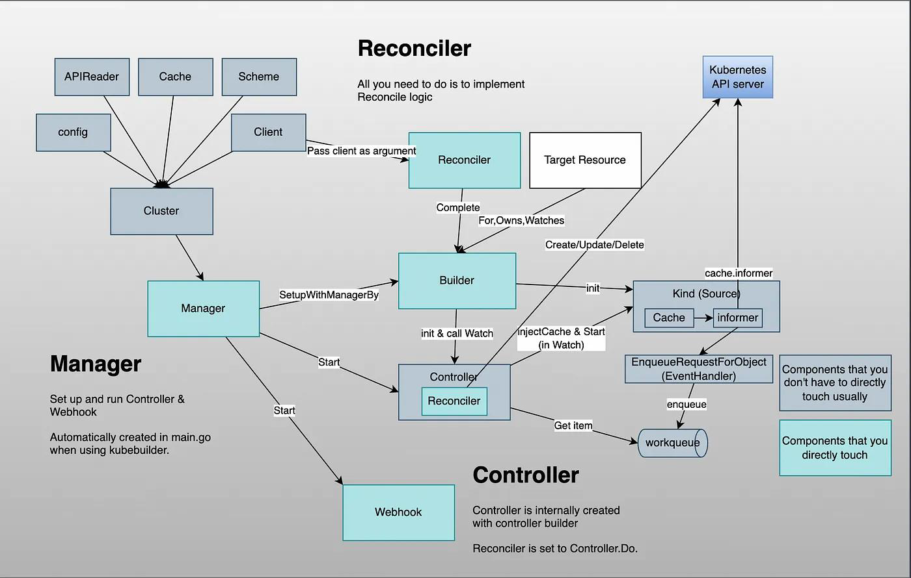
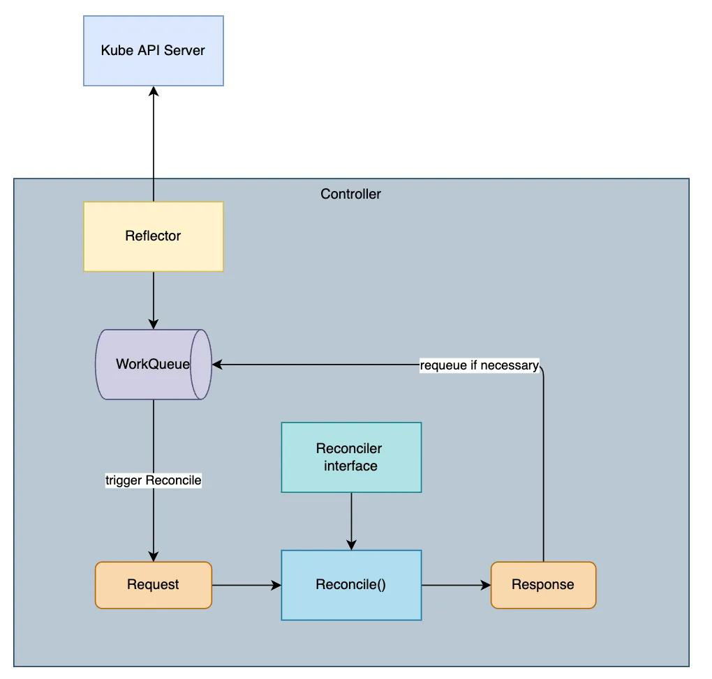
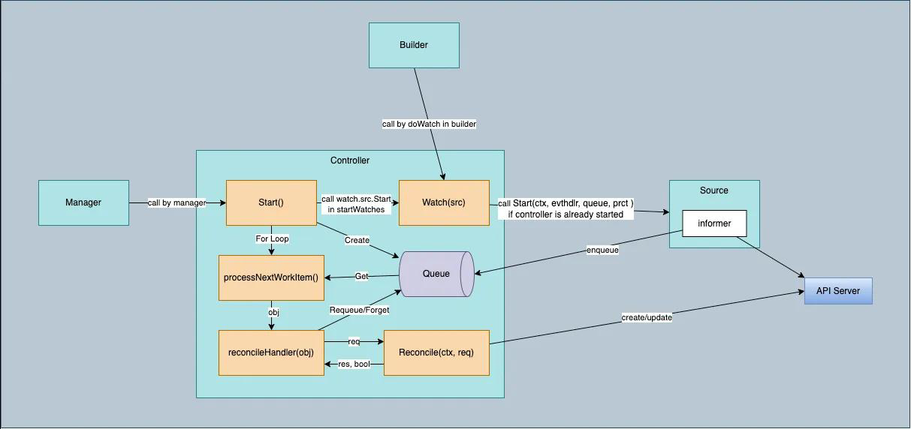

## Operator

Operator = Controller + CRD via **Reconciliation** which drives actual **status** → desired **spec** (eventually).

:thumbsup:

- Re-use Controller Reconciliation.
- Re-use K8s declarative resource definition.
- Re-use K8s application management (self-recovery, rolling-update, automatic restart).
- Integration with K8s primitives, CRUD via kubectl.
- Simplify deployment & management process of stateful application.

:package:

- Customize resources.
- Automate O&M tasks, such as DB backup.
- CI/CD Workflow
- Storage orchestration: Rook, Ceph.

**vs.**

**[Kubebuilder](https://github.com/kubernetes-sigs/kubebuilder)**: a framework for building Kubernetes APIs using CRDs.

**[Operator SDK](https://sdk.operatorframework.io/)**: a open source **toolkit** to manage Kubernetes native applications. It leverages Kubebuilder underlying while offering more capabilities, such as:

- **Operator Lifecycle Manager**: to package & distribute Operator.
- **Operator Hub**: to release Operator.
- **Operator SDK scorecard**: best practice for developing an Operator.

### Kubebuilder

**Components**:

- **Manager**: oversees the lifecycle of controllers.
- **Controller**: watches and reacts to changes in resources.
- **Reconciler**: contains the **logic for reconciling** the state of a resource.
- **Client**: interacts with the Kubernetes API.
- **Cache**: stores resource state locally for efficiency.
- **Webhook**: validates or modifies resources during API requests.



**Flow**:

- **Reconciler** registers into **Controller** via **Builder**.
- **Builder** initializes Kind (Source) which contains Cache & Informer (watch & listen → work queue).
- **Reconciler** in **Controller** will **consume** the item in work queue & process according to logic.
- **Manager** starts **Controller** (with Webhook).



#### Reconciliation

**Switch**:

```go
// Successful, no retry & delete item from work queue.
return ctrl.Result{}, nil

// Failed, requeue
return ctrl.Result{}, err

// Successful but requeue given such as scheduled tasks.
return ctrl.Result{Requeue: true}, nil

// Requeue after a period of time.
return ctrl.Result{RequeueAfter: 5 * time.Second}, nil
```



#### Controller

**Flow:**

- **Informer** in **Source** listens & watches from API Server & populate work queue
- `ProcessNextWorkImen()` dequeues items from work queue & call Reconciliation by `ReconcileHandler()`.

**Work Queue**: Rate Limit Queue.



#### Practice#1

> Use one CRD to generate Deployment, Service & Ingress

CRD:

- **Group/Version**: application.aiops.com/v1

- **Kind**: Application

```bash
$ mkdir application && cd application
$ go mod init github.com/KokoiRuby/module_07_application

# init proj given domain
$ kubebuilder init --domain=aiops.com

# create api given gvk
$ kubebuilder create api --group application --version v1 --kind Application
```

**Project Layout**:

- **/cmd**: The main entry point for the Operator, generated when executing `kubebuilder init`.

- **/api**: API resource definitions; users need to modify the `*_types.go` files to implement custom CRDs, while other files are auto-generated. This is generated when executing `kubebuilder create api`.

- **/internal/controller**: Controllers; users need to modify the `*_controller.go` files to implement custom Reconcile logic. This is generated when executing `kubebuilder create api`.

- /config

  : Objects related to CRDs, auto-generated.

  - **/config/crd**
  - **/config/rbac**
  - **/config/sample**

- **Makefile**: Auto-generated, contains commands for building, testing, running, and deploying the controller.

`/api/v1/application_types.go`

```go
type ApplicationSpec struct {
	Deployment ApplicationDeployment    `json:"deployment"`
	Service    corev1.ServiceSpec       `json:"service"`
	Ingress    networkingv1.IngressSpec `json:"ingress"`
}

type ApplicationDeployment struct {
	Image    string `json:"image"`
	Replicas int32  `json:"replicas"`
	Port     int32  `json:"port"`
}

type ApplicationStatus struct {
	AvailableReplicas int32 `json:"availableReplicas"`
}
```

```bash
# CRD yaml
$ make manifests
```

`/internal/controller/application_controller.go`

```go
func (r *ApplicationReconciler) Reconcile(ctx context.Context, req ctrl.Request) (ctrl.Result, error) {
	logger := log.FromContext(ctx)

	// TODO(user): your logic here
	// Deployment
	var app applicationv1.Application

	// get
	if err := r.Get(ctx, req.NamespacedName, &app); err != nil {
		logger.Error(err, "unable to get Application")
		return ctrl.Result{}, client.IgnoreNotFound(err)
	}

	logger.Info("Reconcile Application", "Application", app.Name)

	// labels
	labels := map[string]string{
		"app": app.Name,
	}

	// create or update deployment
	deployment := &appsv1.Deployment{
		ObjectMeta: metav1.ObjectMeta{
			Name:      app.Name,
			Namespace: app.Namespace,
		},
	}

	_, err := controllerutil.CreateOrUpdate(ctx, r.Client, deployment, func() error {
		replicas := int32(1)
		if app.Spec.Deployment.Replicas != 0 {
			replicas = app.Spec.Deployment.Replicas
		}

		deployment.Spec = appsv1.DeploymentSpec{
			Replicas: &replicas,
			Selector: &metav1.LabelSelector{
				MatchLabels: labels,
			},
			Template: corev1.PodTemplateSpec{
				ObjectMeta: metav1.ObjectMeta{
					Labels: labels,
				},
				Spec: corev1.PodSpec{
					Containers: []corev1.Container{
						{
							Name:  app.Name,
							Image: app.Spec.Deployment.Image,
							Ports: []corev1.ContainerPort{
								{
									ContainerPort: app.Spec.Deployment.Port,
								},
							},
						},
					},
				},
			},
		}

		// set owner ref
		if err := controllerutil.SetControllerReference(&app, deployment, r.Scheme); err != nil {
			return err
		}
		return nil
	})
	if err != nil {
		logger.Error(err, "unable to create or update deployment")
		// failed + requeue
		return ctrl.Result{}, err
	}
	logger.Info("Deployment created or updated")

	// Service
	service := &corev1.Service{
		ObjectMeta: metav1.ObjectMeta{
			Name:      app.Name,
			Namespace: app.Namespace,
		},
	}

	_, err = controllerutil.CreateOrUpdate(ctx, r.Client, service, func() error {
		service.Spec = corev1.ServiceSpec{
			Selector: labels,
			Ports:    app.Spec.Service.Ports,
		}

		// set owner ref
		if err := controllerutil.SetControllerReference(&app, service, r.Scheme); err != nil {
			return err
		}
		return nil
	})
	if err != nil {
		logger.Error(err, "unable to create or update service")
	}
	logger.Info("Service created or updated")

	// Ingress
	ingress := &networkingv1.Ingress{
		ObjectMeta: metav1.ObjectMeta{
			Name:      app.Name,
			Namespace: app.Namespace,
		},
	}

	_, err = controllerutil.CreateOrUpdate(ctx, r.Client, ingress, func() error {
		ingress.Spec = networkingv1.IngressSpec{
			IngressClassName: app.Spec.Ingress.IngressClassName,
			Rules:            app.Spec.Ingress.Rules,
		}

		// set owner ref
		if err := controllerutil.SetControllerReference(&app, ingress, r.Scheme); err != nil {
			return err
		}
		return nil
	})
	if err != nil {
		logger.Error(err, "unable to create or update ingress")
	}
	logger.Info("Ingress created or updated")

	// update status
	app.Status.AvailableReplicas = *deployment.Spec.Replicas
	if err := r.Status().Update(ctx, &app); err != nil {
		logger.Error(err, "unable to update Application status")
		return ctrl.Result{}, err
	}

	return ctrl.Result{}, nil
}
```

```bash
# create crd into cluster
$ make install
```

`config/samples/application_v1_application.yaml`

```yaml
apiVersion: application.aiops.com/v1
kind: Application
metadata:
  labels:
    app.kubernetes.io/name: application
    app.kubernetes.io/managed-by: kustomize
  name: application-sample
spec:
  # TODO(user): Add fields here
  deployment:
    image: nginx
    replicas: 1
    port: 80
  service:
    ports:
      - port: 80
        targetPort: 80
  ingress:
    ingressClassName: nginx
    rules:
      - host: application.aiops.com
        http:
          paths:
            - path: /
              pathType: Prefix
              backend:
                service:
                  name: application-sample
                  port:
                    number: 8080
```

```bash
$ make run

# deploy sample cr
$ kubectl apply -f config/samples/application_v1_application.yaml

# chk
$ kubectl get deploy,svc,ingress

# clean up
$ kukbectl delete deploy application-sample
$ kukbectl delete svc application-sample
$ kukbectl delete ingress application-sample
```

#### Practice#2

> Auto scale by Cronjob

CRD:

- **Group/Version**: autoscaling.aiops.com/v1

- **Kind**: CronHPA

```bash
$ mkdir cronhpa && cd cronhpa
$ go mod init github.com/KokoiRuby/module_07_cronhpa

# init proj given domain
$ kubebuilder init --domain=aiops.com

# create api given gvk
$ kubebuilder create api --group autoscaling --version v1 --kind CronHPA
```

`/api/v1/cronhpa_types.go`

```go
type CronHPASpec struct {
	ScaleTargetRef ScaleTargetReference `json:"scaleTargetRef"`
	Jobs           []JobSpec            `json:"jobs"`
}

type ScaleTargetReference struct {
	ApiVersion string `json:"apiVersion"`
	Kind       string `json:"kind"`
	Name       string `json:"name"`
}

type JobSpec struct {
	Name       string `json:"name"`
	Schedule   string `json:"schedule"`
	TargetSize int32  `json:"targetSize"`
}

type CronHPAStatus struct {
	CurrentReplicas int32 `json:"currentReplicas"`
	// last time to scale
	LastScaleTime *metav1.Time `json:"lastScaleTime"`
	// last time of job to run
	LastRunTime map[string]metav1.Time `json:"lastRunTime"`
}

// +kubebuilder:printcolumn:name="Target",type="string",JSONPath=".spec.scaleTargetRef.Name",description="Target resource"
// +kubebuilder:printcolumn:name="Schedule",type="string",JSONPath=".spec.jobs[*].schedule",description="Cron Expression"
// +kubebuilder:printcolumn:name="Target Size",type="string",JSONPath=".spec.jobs[*].targetSize",description="Target replica"

// CronHPA is the Schema for the cronhpas API
type CronHPA struct { ... }
```

```bash
# # CRD yaml
$ make manifests
```

`/internal/controller/cronhpa_controller.go`

```go
func (r *CronHPAReconciler) Reconcile(ctx context.Context, req ctrl.Request) (ctrl.Result, error) {
	logger := log.FromContext(ctx)

	// TODO(user): your logic here

	logger.Info("Reconciling CronHPA")
	var cronHPA autoscalingv1.CronHPA
	if err := r.Get(ctx, req.NamespacedName, &cronHPA); err != nil {
		logger.Error(err, "unable to get cronHPA")
		return ctrl.Result{}, client.IgnoreNotFound(err)
	}

	now := time.Now()
	var earliestNextRuntime *time.Time

	// iter job to get target size to replicate
	for _, job := range cronHPA.Spec.Jobs {
		// get last run time by job name from status
		lastRuntime := cronHPA.Status.LastRunTime[job.Name]
		// cal next schedule time
		nextScheduledTime, err := r.getNextScheduledTime(job.Schedule, lastRuntime.Time)
		if err != nil {
			logger.Error(err, "unable to get next scheduled time")
			return ctrl.Result{}, err
		}
		logger.Info("Job info", "name", job.Name, "lastRuntime", lastRuntime, "nextScheduledTime", nextScheduledTime)

		// check if current time reaches or exceeds scheduled
		if now.Equal(nextScheduledTime) || now.After(nextScheduledTime) {
			// update replica
			logger.Info("update replicas", "jobs", job.Name, "targetSize", job.TargetSize)
			if err := r.updateDeploymentReplicas(ctx, &cronHPA, cronHPA.Spec.ScaleTargetRef, job); err != nil {
				logger.Error(err, "unable to update replicas")
				return ctrl.Result{}, err
			}

			// update status
			cronHPA.Status.CurrentReplicas = job.TargetSize
			cronHPA.Status.LastScaleTime = &metav1.Time{Time: now}

			// update job last run time
			if cronHPA.Status.LastRunTime == nil {
				cronHPA.Status.LastRunTime = make(map[string]metav1.Time)
			}
			cronHPA.Status.LastRunTime[job.Name] = metav1.Time{Time: now}

			// cal next run time from now
			nextRuntime, _ := r.getNextScheduledTime(job.Schedule, now)
			if earliestNextRuntime == nil || earliestNextRuntime.Before(nextRuntime) {
				earliestNextRuntime = &nextRuntime
			}
		} else {
			// if not reached, set it to next run time
			if earliestNextRuntime == nil || nextScheduledTime.Before(*earliestNextRuntime) {
				earliestNextRuntime = &nextScheduledTime
			}
		}

	}

	// update status
	if err := r.Status().Update(ctx, &cronHPA); err != nil {
		logger.Error(err, "unable to update cronHPA")
		return ctrl.Result{}, err
	}

	// if had next run time, requeue
	if earliestNextRuntime != nil {
		requeueAfter := earliestNextRuntime.Sub(time.Now())
		// past
		if requeueAfter < 0 {
			requeueAfter = time.Second * 1
		}
		logger.Info("requeue after time", "time", requeueAfter)
		return ctrl.Result{RequeueAfter: requeueAfter}, nil
	}

	return ctrl.Result{}, nil
}

func (r *CronHPAReconciler) getNextScheduledTime(schedule string, after time.Time) (time.Time, error) {
	parser := cron.NewParser(cron.Minute | cron.Hour | cron.Dom | cron.Month | cron.Dow)
	cronSchedule, err := parser.Parse(schedule)
	if err != nil {
		return time.Time{}, err
	}
	return cronSchedule.Next(after), nil
}

func (r *CronHPAReconciler) updateDeploymentReplicas(ctx context.Context, cronHPA *autoscalingv1.CronHPA, scaleTargetRef autoscalingv1.ScaleTargetReference, job autoscalingv1.JobSpec) error {
	logger := log.FromContext(ctx)

	deployment := &appsv1.Deployment{}
	deploymentKey := types.NamespacedName{
		Name:      scaleTargetRef.Name,
		Namespace: cronHPA.Namespace,
	}

	// get deployment
	if err := r.Get(ctx, deploymentKey, deployment); err != nil {
		logger.Error(err, "unable to get deployment")
		return err
	}

	// chk replica
	if deployment.Spec.Replicas != nil && *deployment.Spec.Replicas == job.TargetSize {
		logger.Info("Deployment replicas is already in target size.", "targetSize", job.TargetSize)
		return nil
	}

	// update replica
	deployment.Spec.Replicas = &job.TargetSize

	// update deployment
	if err := r.Update(ctx, deployment); err != nil {
		logger.Error(err, "unable to update deployment")
		return err
	}

	logger.Info("Deployment replicas updated", "targetSize", job.TargetSize)
	return nil
}
```

```bash
# create crd into cluster
$ make install
```

`config/samples/autoscaling_v1_cronhpa.yaml`

```yaml
apiVersion: autoscaling.aiops.com/v1
kind: CronHPA
metadata:
  labels:
    app.kubernetes.io/name: cronhpa
    app.kubernetes.io/managed-by: kustomize
  name: cronhpa-sample
spec:
  # TODO(user): Add fields here
  scaleTargetRef:
    apiVersion: apps/v1
    kind: Deployment
    name: nginx
  jobs:
    - name: "scale-up"
      schedule: "*/1 * * * *"
      targetSize: 3

```

```bash
$ make run

# create a deployment
$ kubectl create deployment nginx --image=nginx

# deploy sample cr
$ kubectl apply -f config/samples/autoscaling_v1_cronhpa.yaml

# chk
$ kubectl get deploy

# scale back to 1 & wait for 1min
$ kubectl scale deploy nginx --replicas=1
$ kubectl get deploy -w

# clean up
$ kukbectl delete deploy nginx
```

#### Package

```bash
# image (default DockerHub)
$ export IMG=KokoiRuby/cronhpa-operator:v0.0.1
$ make docker-build docker-push

# operator deploy under dist/install.yaml
$ make build-installer
```

### SDK

[Installation](https://sdk.operatorframework.io/docs/installation/)

#### Practice#1

> Helm chart → Operator

```bash
$ mkdir redis-operator && cd redis-operator
$ go mod init github.com/KokoiRuby/module_07_redis-operator


$ operator-sdk init --domain aiops.com --plugins helm
$ operator-sdk create api \
	--group app \
	--version v1 \
	--kind Redis \
	--helm-chart-repo https://charts.bitnami.com/bitnami \
	--helm-chart redis
$ cd helm-charts/redis && helm dependencies build
$ operator-sdk create api \
	--group app \
	--version v1 \
	--kind Redis \
	--helm-chart ./helm-charts/redis
```

```bash
$ make docker-build docker-push IMG="KokoiRuby/redis-operator:v0.0.1"
$ make deploy IMG="lyzhang1999/redis-operator:v0.0.1"

# RBAC
$ kubectl create clusterrolebinding redis-operator-cluster-admin \
	--serviceaccount=redis-operator-system:redis-operator-controller-manager \
	--clusterrole=cluster-admin
	
$ kubectl apply -f config/samples/app_v1_redis.yaml

# clean
$ make uninstall
```

#### OLM

Lifecycle Manager to **package** Operator & generate **bundles** (OCI image). Similar to `make build-installer`

```bash
$ operator-sdk olm install

# env
$ export IMG=docker.io/KokoiRuby/redis-operator:v0.0.1
$ export BUNDLE_IMG=docker.io/KokoiRuby/redis-operator-bundle:v0.0.1

# build & push
$ make bundle
$ make bundle-build bundle-push

# validate
$ operator-sdk bundle validate $BUNDLE_IMG

# install
$ operator-sdk run bundle $BUNDLE_IMG
```

### Best Practice :construction_worker:

1. Reconcile 不应该关注具体事件（创建、更新、删除），更不应该针对不同事件使用不同逻辑。
2. Reconcile 应该是幂等的，即无论运行多少次，结果都是一样的，因为事件可能会被重复触发。
3. 简化 Reconcile 逻辑，只关注期望状态和当前状态 Diff，执行业务逻辑。

### E2E 
